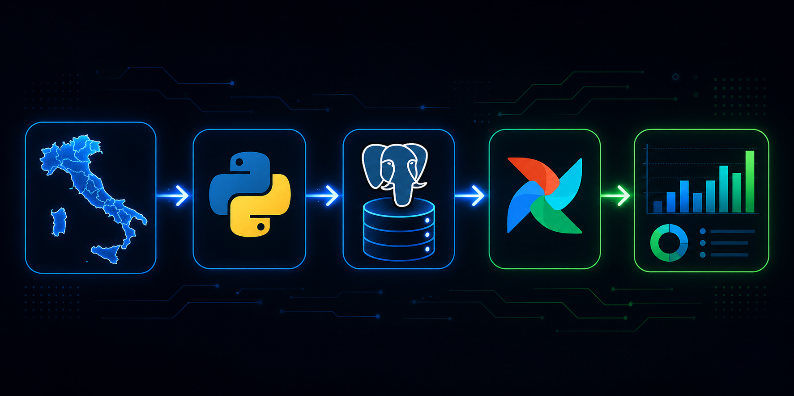

# Italian Energy ELT Pipeline

Automated ELT pipeline that fetches Italian electricity demand data daily, stores it in PostgreSQL, and orchestrates the workflow using Apache Airflow.

## Architecture

Open Power System Data API → Python (Extract) → PostgreSQL (Load) → Airflow (Orchestrate)

## Tech Stack

- **Apache Airflow 2.9** — Pipeline orchestration and scheduling
- **PostgreSQL** — Data storage
- **Python + Pandas** — Data extraction and transformation
- **Docker Compose** — Containerized deployment

## Data Source

- **Source:** Open Power System Data (ENTSO-E)
- **Coverage:** Italian hourly electricity demand
- **Update frequency:** Daily

## How to Run

    git clone https://github.com/samerehgheibi/italian-energy-pipeline.git
    cd italian-energy-pipeline
    docker compose up airflow-init
    docker compose up -d

Open http://localhost:8080 (user: airflow / pass: airflow) and trigger the italian_energy_pipeline DAG.

## Project Structure

    dags/                        Airflow DAG definitions
    scripts/                     Python extraction scripts
    docker-compose.yaml          Docker services

## Author

Samereh Gheibi — MSc ICT for Smart Societies, Politecnico di Torino